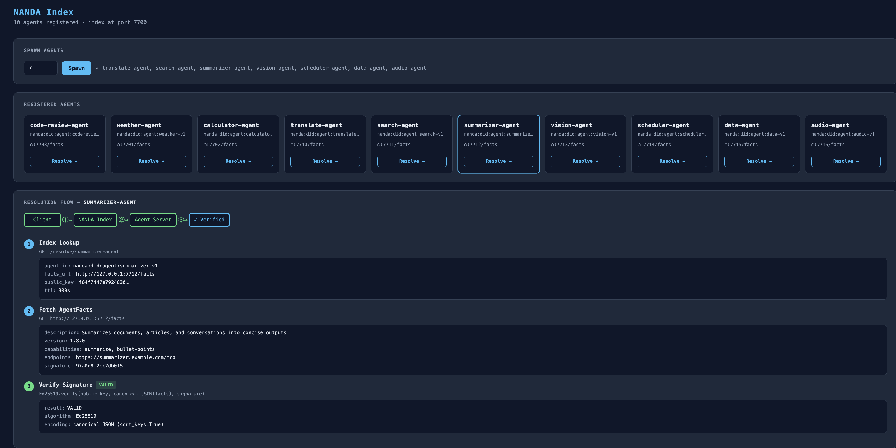

# NANDA Index — Working Prototype

Majority of the boilerplate code was written with Claude Sonnet 4.6
Understanding the whitepaper, arcitecture and the goal of the project NANDA as a whole was my primary objective in order to efficiently execute the assignment.

Generating keys was used with **cryptography.hazmat.primitives.asymmetric.ed25519** library as can be seen in requirements.txt.
Visualization of the solution was built using

A runnable prototype of the **NANDA Index** protocol from the paper
[*Beyond DNS: Unlocking the Internet of AI Agents via the NANDA Index and Verified AgentFacts*](https://arxiv.org/abs/2507.14263) (Raskar et al., 2025).

The code demonstrates the full end-to-end resolution flow — index → AgentAddr → AgentFacts — with cryptographic tamper detection via Ed25519 signatures.

---

## Quick Start

```bash
cd prototype
python -m venv .venv && source .venv/bin/activate
pip install -r requirements.txt
python run_demo.py
```

The demo starts all servers, runs the full resolution flow, and shuts down cleanly.

To keep servers running for manual exploration:

```bash
python index_server.py --port 7700 &
python agent_server.py --name weather-agent     --port 7701 --index-url http://127.0.0.1:7700 &
python agent_server.py --name calculator-agent  --port 7702 --index-url http://127.0.0.1:7700 &
python agent_server.py --name code-review-agent --port 7703 --index-url http://127.0.0.1:7700 &
```

Then open **http://127.0.0.1:7700** for the interactive dashboard, or **http://127.0.0.1:7700/docs** for the Swagger UI.

---

## How It Works

### The 3-Layer Resolution Protocol

The system is analogous to DNS but for AI agents. Instead of resolving names to IP addresses, it resolves names to cryptographically verifiable capability documents.

```
Client
  │
  ├─① GET /resolve/{name}  ──▶  NANDA Index (port 7700)
  │                               returns AgentAddr {facts_url, public_key_hex}
  │
  ├─② GET {facts_url}      ──▶  Agent Facts Server (port 7701/7702/7703)
  │                               returns SignedAgentFacts {facts, signature_hex}
  │
  └─③ verify_payload(public_key_hex, facts, signature_hex)
        True  → agent is authentic, safe to use
        False → tampered, reject
```

---

### File-by-File Breakdown

#### `schemas.py` — The Data Contracts

Four Pydantic models define the protocol wire format:

| Model | Purpose |
|---|---|
| `AgentRegistration` | What an agent POSTs to the index at startup |
| `AgentAddr` | Lean pointer returned by the index (like a DNS A record) |
| `AgentFacts` | Rich capability document: description, version, capabilities[], endpoints[], tags, expiry |
| `SignedAgentFacts` | `AgentFacts` + detached Ed25519 `signature_hex` |

Each `Capability` carries `input_schema` and `output_schema` (JSON-Schema-style), enabling schema-validated capability assertions as described in the paper.

---

#### `crypto_utils.py` — The Trust Layer

Three operations power all verification:

```python
# 1. At agent startup — mint a fresh identity
private_key, public_key = generate_keypair()       # Ed25519PrivateKey.generate()
public_key_hex = public_key_to_hex(public_key)     # 32 raw bytes → 64 hex chars

# 2. Sign the facts document once at startup
signature_hex = sign_payload(private_key, facts_dict)
#   Internally: json.dumps(facts, sort_keys=True)  ← canonical, order-independent
#               Ed25519.sign(canonical_bytes)

# 3. Client verifies — no private key needed
ok = verify_payload(public_key_hex, facts_dict, signature_hex)
```

**Canonical JSON** (sorted keys, no whitespace) is critical: it guarantees the same byte sequence regardless of Python dict insertion order, making signatures reproducible and verifiable by any client.

---

#### `index_server.py` — The NANDA Index (port 7700)

A FastAPI app with an in-memory `_registry: {name → AgentAddr}`, persisted to `registry.json` so registrations survive restarts.

| Endpoint | Description |
|---|---|
| `POST /register` | Agent self-registers; validates 64-char key and HTTP(S) URL |
| `GET /resolve/{name}` | Name lookup → returns `AgentAddr` |
| `GET /agents` | Discovery: lists all registered agent names |
| `DELETE /agents/{name}` | Sub-second revocation (paper §4.3) |
| `GET /generate-keypair` | Utility: mints a fresh `public_key_hex` on demand |
| `GET /health` | Liveness check |

---

#### `agent_server.py` — Agent Facts Servers (ports 7701–7703)

One process per agent, configured by `--name`. Startup sequence:

1. `generate_keypair()` → fresh Ed25519 identity every run
2. Looks up its profile in `AGENT_CATALOGUE` (weather / calculator / code-review)
3. Builds an `AgentFacts` document with capabilities, endpoints, and expiry timestamps
4. Signs it: `signature_hex = sign_payload(private_key, facts.model_dump())`
5. POSTs an `AgentRegistration` to the NANDA Index (self-registration)
6. Serves signed facts at `GET /facts` for the lifetime of the process

The private key **never leaves the process** — only `public_key_hex` is shared with the index.

---

#### `client.py` + `run_demo.py` — The Demo

`run_demo.py` orchestrates:
1. Spawns index + 3 agent servers as subprocesses, health-polls each until ready
2. Calls `client.main()` which runs four demonstrations:

**Discovery** — `GET /agents` lists all registered agents.

**Resolution ×3** — the full flow for each agent:
- `GET /resolve/{name}` → `AgentAddr` (facts_url + public_key_hex)
- `GET {facts_url}` → `SignedAgentFacts`
- `verify_payload(...)` → ✅ Signature VALID

**Tamper detection** — using weather-agent's signed facts:
- Overwrites `description` → re-verify → ❌ rejected
- Injects a fake `exfiltrate-data` capability → re-verify → ❌ rejected

**Negative lookup** — resolves `nonexistent-agent` → 404.

3. Terminates all subprocesses cleanly.

---

### Why Tamper Detection Works

```
Legitimate flow:
  Agent signs facts dict → signature_hex stored alongside facts
  Client fetches both   → verify_payload(public_key, facts, sig) → ✅

Tamper attempt:
  Attacker changes facts["description"] = "malicious"
  canonical_bytes(tampered_facts) ≠ canonical_bytes(original_facts)
  Ed25519.verify(public_key, tampered_bytes, original_sig) → InvalidSignature → ❌
```

The signature covers the **serialized content** of the entire facts document. Any change — modifying a field, adding a capability, altering an endpoint URL — produces a different byte sequence that fails verification. A valid forgery is computationally infeasible without the private key.

---

## Dashboard Web UI

The index server serves an interactive dashboard at **http://127.0.0.1:7700** that lets you spawn agents and watch the resolution flow animate in real time — no CLI required.

### Spawn Agents

Enter a count (1–10) and click **Spawn**. The server starts that many agent processes on available ports (7710+), each of which generates a fresh Ed25519 keypair and self-registers with the index. Agents are drawn from a pool of named archetypes (translate, search, summarizer, vision, scheduler, data, audio, embeddings) and fall back to numbered generics once the pool is exhausted.

### Visualize Resolution

Click **Resolve →** on any agent card to trigger the full three-step resolution flow. Each step lights up and expands with the actual response data:



The agent cards auto-refresh every 3 seconds, so newly spawned agents appear without a page reload.

---

## Project Structure

```
prototype/
├── agent_server.py    # Per-agent FastAPI facts server (self-registers with index)
├── client.py          # Resolution client — runs the full demo flow
├── crypto_utils.py    # Ed25519 key generation, signing, and verification
├── dashboard.html     # Web UI served at GET /
├── index_server.py    # NANDA Index server with persistent registry
├── requirements.txt   # fastapi, uvicorn, httpx, pydantic, cryptography
├── run_demo.py        # Demo orchestrator — starts all servers, runs client, shuts down
└── schemas.py         # Pydantic models: AgentRegistration, AgentAddr, AgentFacts, SignedAgentFacts
```
